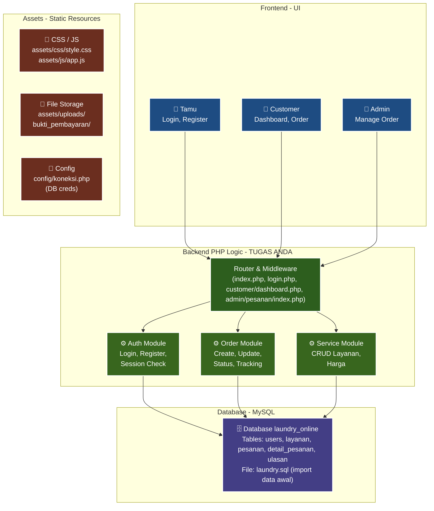

# Sistem Laundry Online (Native PHP & Bootstrap)

Aplikasi manajemen laundry berbasis web yang dibuat menggunakan PHP Native tanpa framework backend, dan Bootstrap untuk desain antarmukanya.

## Fitur Utama
- **Autentikasi Multi-role**: Pemisahan hak akses antara Administrator dan Customer.
- **Manajemen Layanan (Admin)**: CRUD data jenis layanan, harga, dan satuan laundry (Kg/Pcs).
- **Sistem Pemesanan (Customer)**: Memilih layanan menggunakan sistem keranjang belanja interaktif hingga proses checkout.
- **Transaksi & Upload Bukti**: Unggah berkas pembayaran (JPG/PNG) langsung ke sistem oleh pelanggan.
- **Verifikasi & Pelacakan Real-time**: Admin memverifikasi dana masuk dan memperbarui status cucian (Pending -> Proses -> Selesai -> Diambil), yang bisa dipantau langsung oleh customer.
- **Manajemen User (Admin)**: Monitoring data seluruh pengguna terdaftar.
- **Sistem Feedback/Ulasan**: Pelanggan memberikan rating bintang dan review setelah cucian selesai diambil.

- **Sistem Feedback/Ulasan**: Pelanggan memberikan rating bintang dan review setelah cucian selesai diambil.

## Arsitektur Sistem

## Cara Instalasi
1. Clone atau ekstrak folder proyek ini ke dalam direktori server lokal (`htdocs` untuk XAMPP).
2. Nyalakan modul Apache dan MySQL pada control panel local server Anda.
3. Buka phpMyAdmin, buat database baru dengan nama `laundry_online`.
4. Import file database yang berada di `/database/laundry.sql`.
5. Akses sistem melalui browser dengan alamat `http://localhost/laundry-online/`.

## Default Akses Admin
- **Email**: admin@laundry.com
- **Password**: admin123